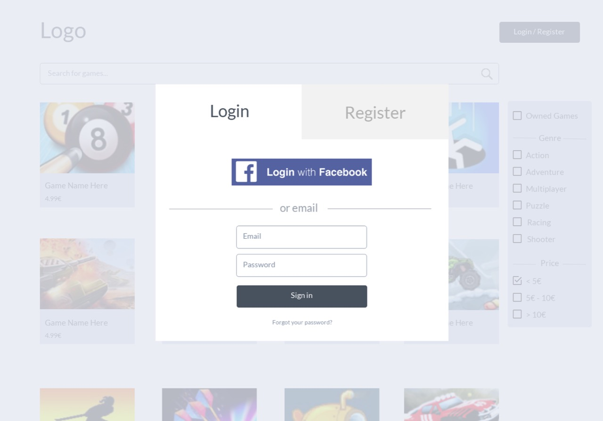

# wsd2018-project

### 1. Team

* 728010 Sataponn Phutrakul
* 721130 Ekaterina Shmeleva
* 528621 Felipe Gonzalez Carceller

### 2. Goal

The goal is to develop an online game store where *(1)* developers can publish and sell games and view statistics for games and *(2)* players can search for games, purchase games via an online payment system, launch and play games, leave public comments for developers and other players, and view leaderboards for individual games.

### 3. Plans

#### 3.1 Basic Features

**Authentication**
* User registration and logging in and out will be implemented using the *Django authentication system*;
* User registration with email verification will be implemented by configuring our Django web application to use the *console backend* for sending emails.

**Player Functionalities**
* Search games and filter games by genre, price, and ownership;
* Purchase games via an online payment system;
* Launch and play games;
* View leaderboards for individual games;
* Leave public Facebook comments and share games on social media (*see 3.2*).

**Developer Functionalities**
* Publish and manage games, including setting and making changes to its URL, description, and price;
* View sales statistics.

**Game Interactions**
* Recording player high-scores.

**Security**
* Players should only be able to play games they have purchased;
* Developers should only be able to modify and access statistics of their own games and should not be able to publish games for other developers;
* Developers should not be able to play games, players should not be able to publish games;
* Etc.

#### 3.2 Extra Features

**3rd Party Login**
* Using Facebook

**RESTful API**
* For searching games
* High scores

**Social Media Sharing**
* Share high scores on Facebook and Twitter with a picture and a link to the service's webpage

**Mobile Friendly**
* Support use across many devices using bootstrap

**Facebook Comments**
* Using a 'Comments Plugin' feature provided by Facebook

### 4. Process and Time Schedule

We communicate using Telegram and we meet a couple of times a week to see how things are going. Most of the development will be done on our own time. We use Trello for project management.

* Week 1: Set up a database and build a simple layout.
* Week 2: Implement authentication.
* Weeks 3-4: Basic player and developer functionalities and CSS.
* Week 5: RESTful API.
* Week 6: Social media sharing and Facebook comments.

### 5. Models
* User
  * id
  * role
  * other parameters from Django

* Games
  * id
  * name
  * URL
  * description
  * imageURL
  * developerId
  * price
  * UserGame

* UserGame
  * id
  * userId
  * gameId
  * createdAt

* Result
  * id
  * userId
  * gameId
  * score
  * createdId

* Category
  * id
  * name

* GameCategory
  * gameId
  * categoryId

### 6. Layout Sketch

A very simple clickable prototype can be found at https://marvelapp.com/405c5bh

The games' thumbnail pictures are from https://www.miniclip.com/games/en/ and are only used for educational purposes.

